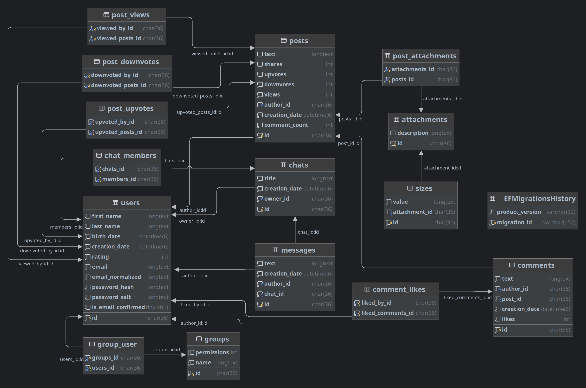

# Netial
[](https://wakatime.com/badge/user/f3bc9eee-86a3-40f2-aced-c53ee1f97155/project/13251fc1-8261-4537-9357-0cff19a6f8c7)

SocIAL NETwork
## Описание предметной области
Социальная сеть - это онлайн-платформа, на которой пользователи могут создавать профили, общаться, делиться контентом и участвовать в различных группах и сообществах.

Предметная область для социальной сети может включать в себя следующие основные элементы:

1. Профили пользователей: каждый пользователь должен иметь свой уникальный профиль, который содержит информацию о них, такую как имя, фотографии, место жительства, контактные данные и т.д.

2. Лента новостей: это основной интерфейс для пользователей, на котором они могут увидеть новости от своих друзей, подписок и групп, в которых они участвуют.

3. Контент: пользователи должны иметь возможность загружать, просматривать и обмениваться контентом, таким как фотографии, видео, статьи, музыка и т.д.

4. Друзья и подписки: пользователи должны иметь возможность добавлять других пользователей в качестве друзей или подписок, чтобы получать их обновления в ленте новостей.

5. Группы и сообщества: пользователи должны иметь возможность создавать и участвовать в группах и сообществах по интересам и увлечениям.

6. Чаты и личные сообщения: пользователи должны иметь возможность общаться друг с другом через чаты и личные сообщения.

7. Поиск: пользователи должны иметь возможность искать других пользователей, контент, группы и сообщества.

8. Настройки приватности: пользователи должны иметь возможность контролировать свою конфиденциальность и выбирать, кто может видеть их профиль, контент и другую информацию.

## [Макет](https://www.figma.com/file/oFReCEWym9Bo7T1CKuA65Y/Netial?t=Rj0lYEBKYKAsjG2u-6)

## Выбранные инструменты разработки

Visual Studio - это мощная интегрированная среда разработки (IDE), которая поддерживает широкий спектр языков программирования, включая C#, Visual Basic и C++. Он предоставляет полный набор инструментов для создания и отладки приложений, включая редактор кода, отладчик, визуальный конструктор и систему контроля версий. Visual Studio также включает встроенную поддержку облачных сервисов Azure, контейнеров Docker и других популярных технологий.

Blazor - это веб-фреймворк для создания интерактивных веб-пользовательских интерфейсов с использованием C# вместо JavaScript. Blazor позволяет разработчикам писать код, который выполняется в браузере с помощью WebAssembly или на сервере с помощью ASP.NET Core. Blazor Server - это модель хостинга, которая запускает компоненты Blazor на сервере и использует SignalR для обновления пользовательского интерфейса в браузере в режиме реального времени.

ASP.NET Core - это кроссплатформенный фреймворк с открытым исходным кодом для создания современных веб-приложений. Он включает в себя набор библиотек и инструментов для создания веб-API, веб-приложений и микросервисов. ASP.NET Ядро предоставляет такие функции, как внедрение зависимостей, промежуточное программное обеспечение и привязка к модели, что упрощает создание масштабируемых и обслуживаемых приложений.
Вместе Visual Studio 2022 и ASP.NET Core Blazor Server предоставляет мощный набор инструментов для разработки современных интерактивных веб-приложений с использованием C# и .NET. Сочетание богатой среды разработки Visual Studio и серверного рендеринга Blazor Server и обновлений в режиме реального времени упрощает создание быстрых, отзывчивых и простых в обслуживании веб-приложений.

## Диаграмма базы данных


## Триггеры

<details>
<summary>При вставке</summary>

```mysql
create trigger onNewView
    after insert
    on post_views
    for each row
begin
        update posts
            set posts.views = posts.views + 1
        where id = new.viewed_posts_id;
    end;
```
```mysql
create trigger onNewUpvote
    after insert
    on post_upvotes
    for each row
begin
        update posts
            set posts.upvotes = posts.upvotes + 1
        where id = new.upvoted_posts_id;
    end;
```
```mysql
create trigger onNewDownvote
    after insert
    on post_downvotes
    for each row
begin
        update posts
            set posts.downvotes = posts.downvotes + 1
        where id = new.downvoted_posts_id;
    end;
```
```mysql
create trigger onNewCommentLike
    after insert
    on comment_likes
    for each row
begin
        update comments
            set comments.likes = comments.likes + 1
        where id = new.liked_comments_id;
    end;
```
```mysql
    create trigger onNewComment
        after insert
        on comments
        for each row
    begin
        update posts
        set posts.comment_count = posts.comment_count + 1
        where id = new.post_id;
    end;
```

</details>

<details>
    <summary>При удалении</summary>

```mysql
create trigger onRemoveComment
    after delete 
    on comments
    for each row
begin
    update posts
    set posts.comment_count = posts.comment_count - 1
    where id = old.post_id;
end;
```
```mysql
create trigger onRemoveUpvote
    after delete 
    on post_upvotes
    for each row
begin
    update posts
    set posts.upvotes = posts.upvotes - 1
    where id = old.upvoted_posts_id;
end;
```
```mysql
create trigger onRemoveDownvote
    after delete
    on post_downvotes
    for each row
begin
    update posts
    set posts.downvotes = posts.downvotes - 1
    where id = old.downvoted_posts_id;
end;
```
```mysql
create trigger onRemoveView
    after delete 
    on post_views
    for each row
begin
    update posts
    set posts.views = posts.views - 1
    where id = old.viewed_posts_id;
end;
```
```mysql
create trigger onCommentUnlike
    after delete 
    on comment_likes
    for each row
begin
    update comments
    set comments.likes = comments.likes - 1
    where id = old.liked_comments_id;
end;
```

</details>
